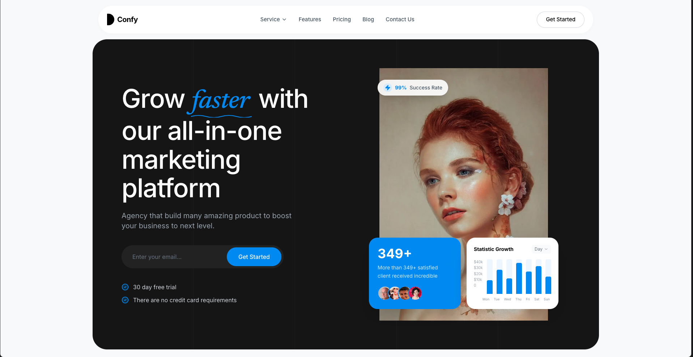
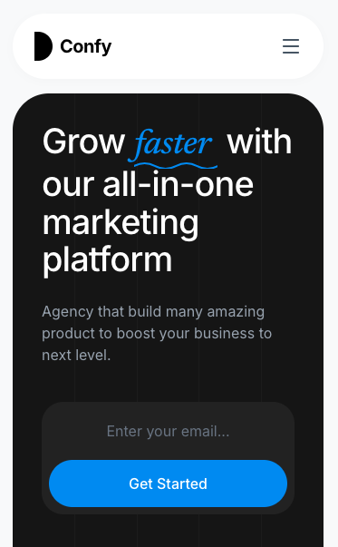

# Confy - All-In-One Marketing Platform
**Grow faster with our premium, high-converting agency landing page.**

[Live Demo](https://marketing-agency-landing-page-alpha.vercel.app/) • [Deploy to Vercel](https://vercel.com/new) • [Documentation](https://github.com/drimdave/confy-marketing-platform#readme)

### Screenshots


<br />

</div>

---

## Overview

**Confy** is a modern, high-end marketing agency landing page designed to wow your clients from the first click. Built with **Next.js 15**, **Tailwind CSS 4**, and **Motion**, it combines sleek aesthetics with lightning-fast performance and advanced animations.

## Key Features

- **Premium Aesthetic**: Modern dark mode with glassmorphism and vibrant blue accents.
- **Fully Responsive**: Optimized for Mobile, Tablet, and Desktop viewports.
- **Next.js 15 Power**: Utilizing the latest App Router and React Server Components.
- **Sleek Animations**: Smooth entrance animations and floating UI elements powered by Motion.
- **Dynamic Components**: 
  - Interactive Hero with unique serif typography.
  - Statistic Growth Visualization & Trusted Brands slider.
  - Multi-tier Flexible Pricing plans.
  - Responsive Social Proof (Testimonials).
  - High-converting CTA forms.
- **SEO Optimized**: Pre-configured metadata and semantic HTML for search engines.

## Tech Stack

- **Framework**: [Next.js 15 (App Router)](https://nextjs.org/)
- **Styling**: [Tailwind CSS 4](https://tailwindcss.com/)
- **State Management**: [React 19](https://reactjs.org/)
- **Animations**: [Motion](https://motion.dev/)
- **Icons**: [Lucide React](https://lucide.dev/)
- **Type Safety**: [TypeScript](https://www.typescriptlang.org/)

## Getting Started

### Prerequisites

- [Node.js 18+](https://nodejs.org/)
- [npm](https://www.npmjs.com/) or [yarn](https://yarnpkg.com/)

### Installation

1. **Clone the repository**:
   ```bash
   git clone https://github.com/your-username/confy-marketing-platform.git
   cd confy-marketing-platform
   ```

2. **Install dependencies**:
   ```bash
   npm install
   ```

3. **Start the development server**:
   ```bash
   npm run dev
   ```

Visit [http://localhost:3000](http://localhost:3000) to see your app in action.

## Deployment

The easiest way to deploy your Confy landing page is to use the [Vercel Platform](https://vercel.com/new?utm_medium=default-template&filter=next.js&utm_source=create-next-app&utm_campaign=create-next-app-readme).

1. Push your code to GitHub.
2. Connect your repository to Vercel.
3. Click **Deploy**.

---

<div align="center">
Built with care by [drimdave](https://github.com/drimdave)
</div>
